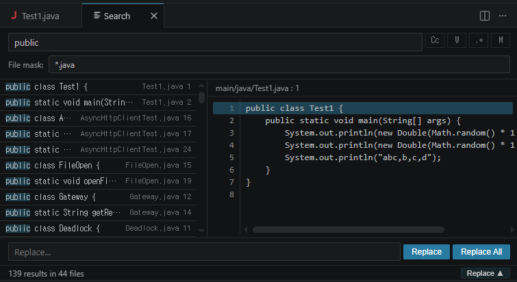

# Wide Search

에디터 탭 기반 **Find in Files** — VSCode 확장

[English](README.md)

## 왜 만들었나

VSCode 기본 검색(`Ctrl+Shift+F`)은 사이드바에 결과가 나오고 미리보기가 좁습니다.
에디터 탭 전체를 쓰는 넓은 검색 패널이 있으면 좋겠다고 생각했습니다.

**Wide Search**는 기본 검색을 대체하는 에디터 탭 기반 검색입니다:
- 검색 결과를 한눈에 볼 수 있는 플랫 리스트
- 미리보기에서 바로 코드 수정 가능
- 입력하는 즉시 검색



## 주요 기능

- **즉시 검색** — 입력과 동시에 결과 표시 (ripgrep 기반)
- **바꾸기** — 선택 1건 교체 또는 전체 교체, 즉시 저장
- **미리보기 편집** — 결과 클릭 → 미리보기 → 바로 수정 → 1초 후 자동 저장
- **플랫 결과 리스트** — 매치마다 한 줄씩, 파일명과 라인번호 표시
- **정규식 바꾸기** — `\n`, `\t` 이스케이프와 `$1` 캡처 그룹 지원
- **멀티라인 검색/바꾸기** — M 버튼으로 전환, 개행 텍스트 붙여넣기 시 자동 활성화
- **폴더 범위 검색** — Explorer에서 폴더 우클릭으로 해당 폴더만 검색
- **미저장 파일 자동 저장** — 검색 전에 열린 파일을 자동 저장하여 최신 내용 검색
- **검색 히스토리** — 최대 50개, 화살표 키로 이전 검색어 탐색
- **필터** — 파일 마스크 (예: `*.ts, *.java`), 대소문자, 정규식
- **키보드 중심** — 마우스 없이 검색부터 파일 열기까지 가능
- **테마 연동** — VSCode 테마 색상 자동 반영
- **다국어** — 한국어/영어 자동 감지
- **크로스 플랫폼** — Windows, Linux, macOS

## 설치

### VS Code 확장 마켓플레이스에서 설치

1. VS Code에서 Extensions (`Ctrl+Shift+X`) 열기
2. **"Wide Search"** 검색 후 **Install** 클릭

또는 [VS Code Marketplace 웹사이트](https://marketplace.visualstudio.com/vscode)에서 "Wide Search"를 검색하여 설치할 수도 있습니다.

### VSIX 빌드 후 설치

```bash
git clone https://github.com/ddakker/vscode-wide-search-extension
cd vscode-wide-search-extension
npm install
./package.sh
code --install-extension wide-search-0.1.0.vsix
```

### VS Code에서 VSIX 직접 설치

1. Extensions (`Ctrl+Shift+X`) 열기
2. `...` → **VSIX에서 설치...** 선택
3. `.vsix` 파일 선택

## 단축키

### 전역

| 단축키 | 동작 |
|--------|------|
| `Ctrl+Shift+F` | 검색 패널 열기 |
| `Ctrl+Shift+R` | 바꾸기 패널 열기 |
| `Ctrl+Shift+H` | 바꾸기 패널 열기 (VSCode 기본) |

### 검색 패널

| 단축키 | 동작 |
|--------|------|
| 검색창 입력 | 즉시 검색 |
| `↑` / `↓` | 결과 이동 / 히스토리 탐색 |
| `Enter` | 해당 라인에서 파일 열기 |
| `Esc` | 패널 닫기 / 미리보기에서 검색으로 돌아가기 |
| `Tab` / `Shift+Tab` | 포커스 이동: 검색 → 결과 → 바꾸기 |
| `Alt+C` | 대소문자 구분 |
| `Alt+R` | 정규식 |
| `Alt+M` | 멀티라인 |
| 더블클릭 | 해당 라인에서 파일 열기 |

### 미리보기 에디터

| 단축키 | 동작 |
|--------|------|
| 텍스트 수정 | 1초 후 자동 저장 |
| `Esc` | 검색 입력으로 돌아가기 |
| `Tab` | 탭 문자 삽입 |

## 사용법

### 검색

1. `Ctrl+Shift+F`로 열기
2. 입력하면 바로 결과 표시
3. 결과 클릭으로 미리보기
4. 더블클릭 또는 `Enter`로 에디터에서 열기

### 바꾸기

1. `Ctrl+Shift+R` (또는 `Ctrl+Shift+H`)로 열기
2. 검색어와 바꿀 내용 입력
3. **바꾸기** — 선택된 매치 1건 교체
4. **전체 바꾸기** — 모든 매치 교체 후 에디터로 이동
5. 정규식 모드에서 바꿀 내용에 `\n`/`\t` 사용 가능

### 폴더 범위 검색

1. Explorer에서 폴더 우클릭 → **Wide Search: Find in Folder**
2. 해당 폴더 안에서만 검색 (상단에 범위 표시)
3. **X** 버튼으로 범위 해제 → 전체 검색

### 멀티라인

- **M** 버튼 또는 `Alt+M`으로 전환
- 검색/바꾸기 입력이 여러 줄로 확장
- 개행 텍스트 붙여넣기 시 자동 전환

### 미리보기 편집

- 결과 클릭하면 미리보기에 파일 로드
- 바로 수정 가능 — 1초 후 자동 저장
- 수정하면 결과 리스트도 실시간 갱신

## 요구 사항

- VSCode 1.85.0 이상
- ripgrep (VSCode에 내장)

## 라이선스

Apache License 2.0
